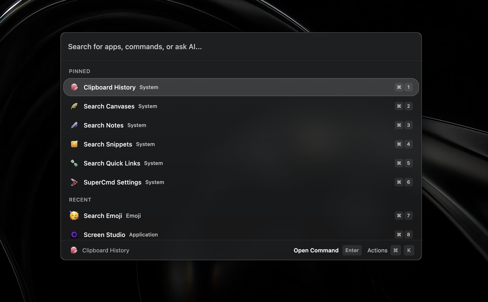

<div align="center">
<p align="center">
  
</p>

<h1 align="center"><b>SuperCmd</b></h1>
<h4 align="center">Raycast + Wispr Flow + Speechify + Memory + AI</h4>

<p align="center">
  <a href="https://supercmd.sh"></a>
  <a href="https://www.electronjs.org/"></a>
  <a href="https://discord.gg/CsdbknHqx5"></a>
  <a href="http://makeapullrequest.com"></a>
</p>

<p align="center">Open-source launcher for macOS with Raycast-compatible extensions, voice workflows, and AI-native actions.</p>
</div>



Open-source launcher for macOS: **Raycast + Wispr Flow + Speechify + Memory + AI** in one app.

SuperCmd gives you Raycast-style extension workflows, hold-to-speak dictation, natural text-to-speech, and AI actions backed by configurable providers and memory.

## What It Is

SuperCmd is an Electron + React launcher that focuses on Raycast extension compatibility while remaining community-driven and open source.

## Key Features

- Raycast extension compatibility runtime (`@raycast/api` and `@raycast/utils` shims)
- Extension discovery/install/update flow
- Script command support
- **Wispr Flow-style** voice input: hold to speak, release to type
- **Speechify-style** read-aloud flow for selected text
- **Memory-aware AI** support (Supermemory integration)
- AI integrations (Ollama / OpenAI / Anthropic / ElevenLabs for speech)
- Native macOS helpers (hotkeys, color picker, speech, snippet expansion)

## Tech Stack

- Electron (main process)
- React + Vite (renderer)
- TypeScript
- Swift binaries for macOS-native integrations

## Project Structure

```text
src/main/        Electron main process, IPC, extension execution, settings
src/renderer/    React UI + Raycast compatibility layer
src/native/      Swift native helpers
extensions/      Installed/managed extension data
dist/            Build output
```

## Install

### Download the app

Download the latest `.dmg` from the [Releases page](https://github.com/SuperCmdLabs/SuperCmd/releases/latest):

- **Apple Silicon (M1/M2/M3/M4):** `SuperCmd-x.x.x-arm64.dmg`
- **Intel Mac:** `SuperCmd-x.x.x.dmg`

Open the `.dmg`, drag SuperCmd to your Applications folder, and launch it.

> **Note:** On first launch, macOS may warn that the app is from an unidentified developer. Go to System Settings → Privacy & Security and click "Open Anyway".

### macOS Permissions

SuperCmd needs the following permissions to work properly. The app will prompt you on first use, or you can enable them manually in **System Settings → Privacy & Security**:

| Permission | Why | Required for |
|---|---|---|
| **Accessibility** | Window management, keystroke injection | Window tiling, snippet expansion |
| **Input Monitoring** | Global hotkey detection (hold-to-speak, launcher shortcut) | Core launcher functionality |
| **Microphone** | Voice dictation (speech-to-text) | Optional — only if using voice features |
| **Automation (AppleScript)** | Selected text capture, system automation | Extension actions |

> You may need to restart the app after granting permissions.

### Auto-updates

SuperCmd includes a built-in auto-updater. You can also check for updates manually from the launcher (search "Check for Updates").

---

## Development Setup

Want to build from source or contribute? Follow these steps.

### Prerequisites

- **macOS** (required — native Swift modules won't compile on Linux/Windows)
- **Node.js 22+** — check with `node -v`
- **npm** — comes with Node.js
- **Xcode Command Line Tools** — required for `swiftc` (Swift compiler)
- **Homebrew** — used at runtime to resolve `git` and `npm` for extension installation (see `extension-registry.ts`)

### 1. Install system dependencies

If you don't have Xcode Command Line Tools:
```bash
xcode-select --install
```

Verify Swift is available:
```bash
swiftc --version
```

If you don't have Homebrew (required for extension management — SuperCmd uses brew-resolved `git` to clone extensions from GitHub):
```bash
/bin/bash -c "$(curl -fsSL https://raw.githubusercontent.com/Homebrew/install/HEAD/install.sh)"
```

### 2. Clone and install
```bash
git clone https://github.com/SuperCmdLabs/SuperCmd.git
cd SuperCmd
npm install
```

### 3. Build native modules

The `dev` script does **not** compile the Swift native helpers — you need to build them once before your first run:
```bash
npm run build:native
```

This compiles the Swift binaries (color picker, hotkey monitor, speech recognizer, window manager, etc.) into `dist/native/`.

### 4. Run in development mode
```bash
npm run dev
```

This starts:

- TypeScript watch for main process
- Vite dev server for renderer
- Electron app in development mode

### 5. Build for production
```bash
npm run build
```

This runs `build:main` + `build:renderer` + `build:native` in sequence.

### 6. Package the app
```bash
npm run package
```

Output artifacts are generated under `out/`.

### Troubleshooting

| Problem | Solution |
|---|---|
| `swiftc: command not found` | Run `xcode-select --install` and restart your terminal |
| `npm install` fails on native modules | Ensure Xcode CLT is installed and up to date: `softwareupdate --install -a` |
| App launches but hotkeys don't work | Grant **Input Monitoring** permission (not just Accessibility) and restart the app |
| Window management doesn't work | Grant **Accessibility** permission — `window-adjust.swift` checks `AXIsProcessTrusted()` |
| Extensions fail to install | Verify Homebrew is installed (`brew --version`) — SuperCmd needs brew-resolved `git` to clone extensions |
| `node-gyp` build errors | Check Node.js version (`node -v`) — requires 22+. Try deleting `node_modules` and re-running `npm install` |
| Apple Silicon (M1/M2/M3) issues | Ensure you're running the arm64 version of Node.js, not the x64 version via Rosetta |
| Native features missing after `npm run dev` | Run `npm run build:native` first — the dev script doesn't compile Swift binaries |

## AI + Memory Setup (Detailed)

You can configure everything from the app UI:

1. Launch SuperCmd.
2. Open **Settings**.
3. Go to **AI** tab.
4. Turn AI on (`enabled = true` in settings).
5. Pick your default provider (`OpenAI`, `Claude`, or `Ollama`).
6. Add the required key(s) and model settings.

### Provider keys

- OpenAI: set `openaiApiKey`
- Anthropic (Claude): set `anthropicApiKey`
- Ollama: set `ollamaBaseUrl` (default `http://localhost:11434`)

### Speech / voice-related keys

- ElevenLabs (for STT/TTS options): set `elevenlabsApiKey`
- Built-in Edge TTS option does not require an API key

### ElevenLabs quick voice test

Working preset voices in SuperCmd:

- `Rachel` (`21m00Tcm4TlvDq8ikWAM`)
- `Domi` (`AZnzlk1XvdvUeBnXmlld`)
- `Bella` (`EXAVITQu4vr4xnSDxMaL`)
- `Antoni` (`ErXwobaYiN019PkySvjV`)
- `Elli` (`MF3mGyEYCl7XYWbV9V6O`)
- `Josh` (`TxGEqnHWrfWFTfGW9XjX`)
- `Arnold` (`VR6AewLTigWG4xSOukaG`)
- `Adam` (`pNInz6obpgDQGcFmaJgB`)
- `Sam` (`yoZ06aMxZJJ28mfd3POQ`)

Sample curl command:

```bash
curl -X POST "https://api.elevenlabs.io/v1/text-to-speech/21m00Tcm4TlvDq8ikWAM?output_format=mp3_44100_128" \
  -H "xi-api-key: $ELEVENLABS_API_KEY" \
  -H "Content-Type: application/json" \
  -d '{"text":"Hello from SuperCmd","model_id":"eleven_multilingual_v2"}' \
  --output elevenlabs-sample.mp3
```

### Memory keys

- Supermemory API key: `supermemoryApiKey`
- Supermemory client id: `supermemoryClient`
- Supermemory base URL: `supermemoryBaseUrl` (default `https://api.supermemory.ai`)
- Optional local mode: `supermemoryLocalMode`

### Where settings are stored

All app settings (including AI keys) are persisted in:

`~/Library/Application Support/SuperCmd/settings.json`

Important fields inside `settings.json`:

```json
{
  "ai": {
    "enabled": true,
    "provider": "openai",
    "openaiApiKey": "",
    "anthropicApiKey": "",
    "elevenlabsApiKey": "",
    "supermemoryApiKey": "",
    "supermemoryClient": "",
    "supermemoryBaseUrl": "https://api.supermemory.ai",
    "supermemoryLocalMode": false,
    "ollamaBaseUrl": "http://localhost:11434",
    "defaultModel": "openai-gpt-4o-mini",
    "speechToTextModel": "native",
    "textToSpeechModel": "edge-tts"
  }
}
```

### Optional environment variable fallbacks

- `ELEVENLABS_API_KEY`
- `SUPERMEMORY_API_KEY`
- `SUPERMEMORY_CLIENT`
- `SUPERMEMORY_BASE_URL`
- `SUPERMEMORY_LOCAL`

## Contributing

We welcome contributions! See [CONTRIBUTING.md](./CONTRIBUTING.md) for detailed guidelines on development setup, code architecture, PR conventions, and more.

Quick version:

1. Fork the repo and create a feature branch.
2. Make your changes, keeping Raycast extension compatibility in mind.
3. Run `npm run build` to verify.
4. Open a PR with a clear description of what, why, and how you tested.

## Useful Commands

```bash
npm run dev            # Start local development
npm run build          # Build main, renderer, and native modules
npm run build:main     # Build Electron main process TS
npm run build:renderer # Build renderer with Vite
npm run build:native   # Compile Swift helpers
npm run package        # Build and package app with electron-builder
```

## References

- Raycast API docs: https://developers.raycast.com/api-reference/
- Raycast extension store: https://www.raycast.com/store

## GitHub Star History

[](https://star-history.com/#SuperCmdLabs/SuperCmd&Date)
